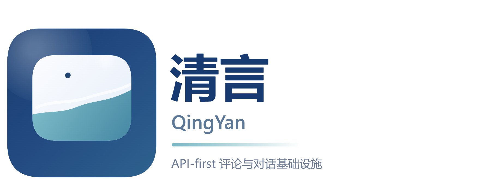

# 清言

<p align="center" style="background-color:#fff">
  
</p>


清言（QingYan）是一个很干净、API-first 的评论与对话基础设施。当前基线聚焦后端接口与后台管理能力，可服务于 FangYuan 等内容站点的评论、验证码、页面点赞和管理需求。

它不是论坛系统、评论 SaaS，也不是强调自有前端体验的完整评论产品。当前仓库提供的是一个可自部署、可继续演进、低噪声的评论后端基线。

QingYan 与 FangYuan 通过公开 HTTP API 契约解耦：FangYuan 只是当前一个已接入的前端，不要求和 QingYan 同步发布，也不依赖 QingYan 仓库内的实现细节或发布节奏。

## 当前能力

- 评论首屏 bootstrap：`GET /api/comments/bootstrap`
- 评论线程分页：`GET /api/comments/thread`
- 评论创建、投票、验证码验证
- bootstrap 返回 `commentForm.allow / require`，前端可按 `nickname | email | website` 动态渲染必填项
- 页面点赞
- 后台登录（管理员登录验证码 + 5 次失败永久封禁 IP）
- 后台评论审核、黑名单、页面管理、用户管理、访客管理、站点总览、运行时设置、系统设置
- 本地 `logs/access` 与 `logs/app` 双通道日志
- 文本 `.log` + 结构化 `.jsonl` 双格式落盘
- 后台可动态调整日志等级和保留天数
- 浏览器后台入口：`GET /admin`
- SQLite + Drizzle migration 基线
- Docker / Compose 本地或单机部署

## 快速开始

### 1. 安装依赖

```bash
pnpm install
```

### 2. 准备配置

```bash
cp config/qingyan.example.yml config/qingyan.yml
```

然后根据实际环境修改：

- `server.publicBaseUrl`
- `admin.tokenHash`
- `sites[].allowedOrigins`
- `security.publicOriginGuard.allowMissingOrigin`
- `database.sqlite.file`

### 3. 校验配置

```bash
pnpm config:check
pnpm config:check:local
```

### 4. 生成 / 同步数据库基线

```bash
pnpm db:generate
pnpm db:migrate
```

### 5. 启动开发服务

```bash
pnpm dev
```

默认监听地址：

- API: `http://localhost:4401`
- OpenAPI JSON: `http://localhost:4401/openapi.json`
- OpenAPI YAML: `http://localhost:4401/openapi.yaml`
- API Docs: `http://localhost:4401/docs`

## 配置文档

- 完整配置说明见 [docs/configuration.md](docs/configuration.md)
- 入库示例见 `config/qingyan.example.yml`
- 本地实参默认使用 `config/qingyan.yml`

## OpenAPI

- 规格文件：[`docs/openapi.yaml`](docs/openapi.yaml)
- 运行时 YAML：`GET /openapi.yaml`
- 运行时 JSON：`GET /openapi.json`
- 文档页：`GET /docs`

## Docker / Compose

### Docker 构建

```bash
docker build -t qingyan:local .
```

### Compose 启动

```bash
docker compose up --build
```

默认 Compose 会：

- 暴露 `4401:4401`
- 挂载 `./config:/app/config`
- 挂载 `./data:/app/data`
- 使用 `/healthz` 做健康检查

## 数据库与 `drizzle/`

`drizzle/` 目录需要入仓库。

原因很简单：它不是缓存，而是当前数据库结构的 migration 基线。没有它，就无法稳定重建 SQLite schema，也无法保证不同环境使用的是同一版数据库结构。

常用命令：

```bash
pnpm db:generate
pnpm db:migrate
pnpm db:studio
```

## 开发命令

```bash
pnpm typecheck
pnpm test
pnpm build
pnpm check
pnpm dev:smoke
```

`pnpm check` 会串行执行格式检查、lint、typecheck、测试、构建和示例配置校验。

## 本地 Dev Mode

需要快速联调验证码、评论 seed 或后台场景时，可使用：

```bash
QINGYAN_DEV_MODE=true pnpm dev
```

可选环境变量：

```bash
QINGYAN_DEV_ADMIN_TOKEN=dev-token
QINGYAN_DEV_ALLOWED_ORIGIN=http://localhost:4321
```

如果只需要运行内置 mock，不希望连接或初始化 SQLite，可使用无数据库模式：

```bash
QINGYAN_DATABASE_MODE=none QINGYAN_DEV_ADMIN_TOKEN=dev-token pnpm dev
```

无数据库模式会自动启用 dev mode，并使用运行时内存状态提供完整 dev mock 控制面和前台业务 API；进程重启后 mock 状态会丢失。

dev mode 只新增 `/api/dev/*` 控制面；正常业务接口仍然是 `/api/*` 与 `/admin`。前端在 dev mode 下依然需要显式传 `siteKey: "default"`。

更详细的下游联调方式、场景调用顺序、错误处理与 UI 对接建议见 [docs/dev-mode-integration.md](docs/dev-mode-integration.md)。
